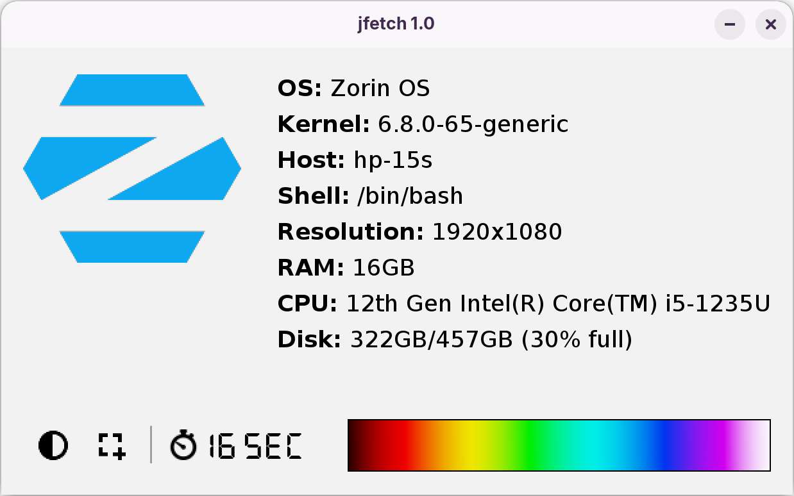
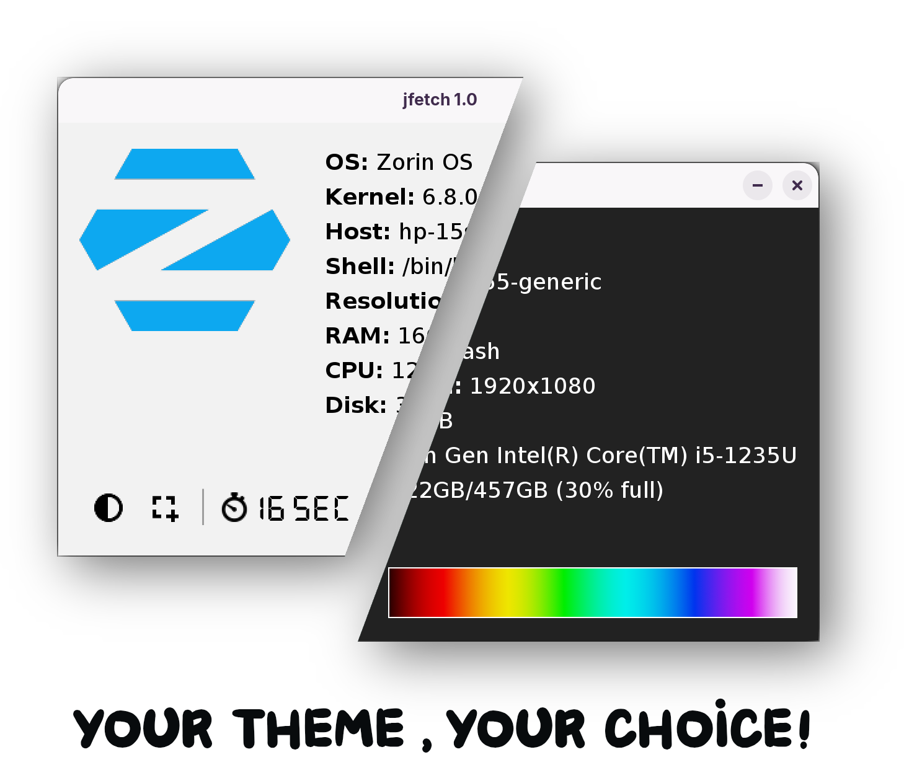
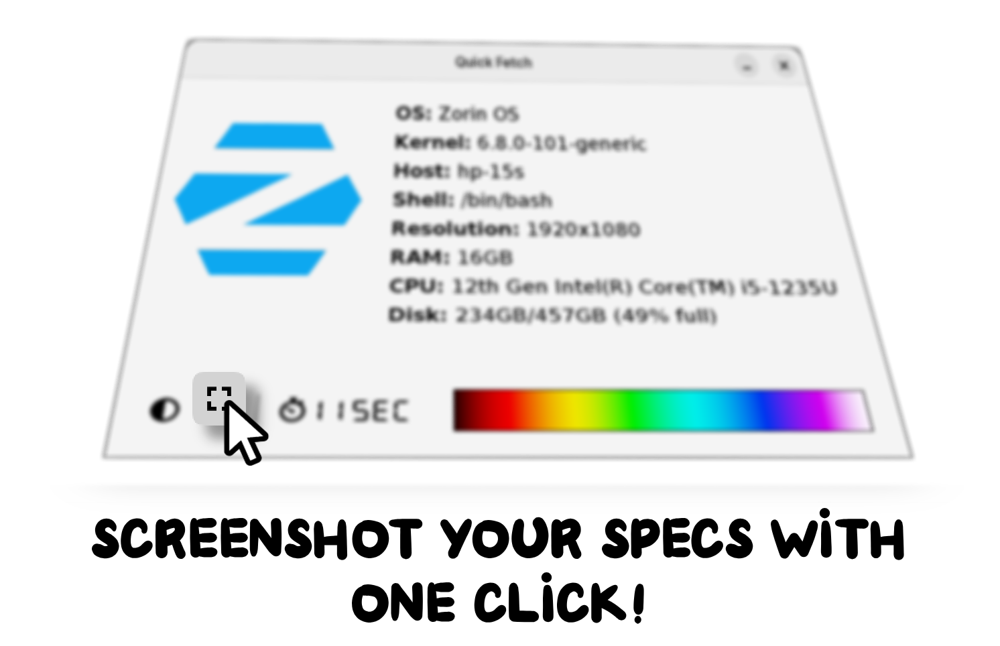

#  JFectch  
A Java GUI-based Neofetch application made using Swing that supports showing info for up to 44 distros. 

## Features
- Shows system info for most Linux distros as well as FreeBSD, NetBSD, OpenBSD and Oracle Solaris
- Animated dark and light mode toggle
- Animated one-click screenshot button for specs
- Boot time display (Linux only)
- Consistent modern flat UI that doesn’t rely on any Look and Feel
  
**NOTE:** The boot time function is only available on Linux. On BSD and Solaris, it will display "Unavailable".

This app supports most Linux distros as well as FreeBSD, NetBSD, OpenBSD and Oracle Solaris

   

## Running project
To run jfetch, use `cd dist` and then `java -jar JFetch.jar`

## Common problems and solutions
1) JFetch relies on bash to fetch some information from your system. If it gives off any type of error such as `/bin/bash not found`
- You will need to copy the bash binary from its original place to /bin and re run the project or create a symbolic link
- You will need to make sure bash is installed on your system

2) JFetch requires execution permition to run
- You will have to use `chmod +x JFetch.jar` to give it permition to run

Copyright (c) 2025 AndronikosGl. All rights reserved.

This repository contains proprietary code. You may view the code, but you **may not copy, modify, redistribute, or use it for commercial purposes** without explicit written permission from the copyright holder.

