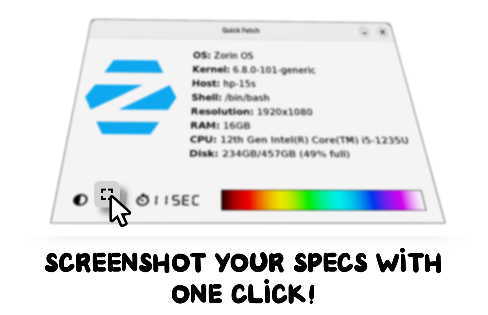

#  JFectch  
A Java GUI-based Neofetch application made using Swing that supports showing info for up to 44 distros. 

## Features
- Shows system info for most Linux distros as well as FreeBSD, NetBSD, OpenBSD and Oracle Solaris
- Animated dark and light mode toggle
- Animated one-click screenshot button for specs
- Boot time display (Linux only)
- Consistent modern flat UI that doesn’t rely on any Look and Feel
  
**NOTE:** The boot time function is only available on Linux. On BSD and Solaris, it will display "Unavailable".

   

To run it go the `dist` directory using `cd dist` and execute `java -jar "JFetch.jar"`. Bare in mind that if it doesnt run you have to use `chmod +x JFectch.jar` to give it executable permitions

## Trademark Notice

All distribution logos included in this project are the property of their respective owners. 
They are included **for informational and identification purposes only** and do not imply endorsement or sponsorship by the respective trademark owners.

This repository is licenced under the MIT Licence and does not cover any logos seen in this project.

